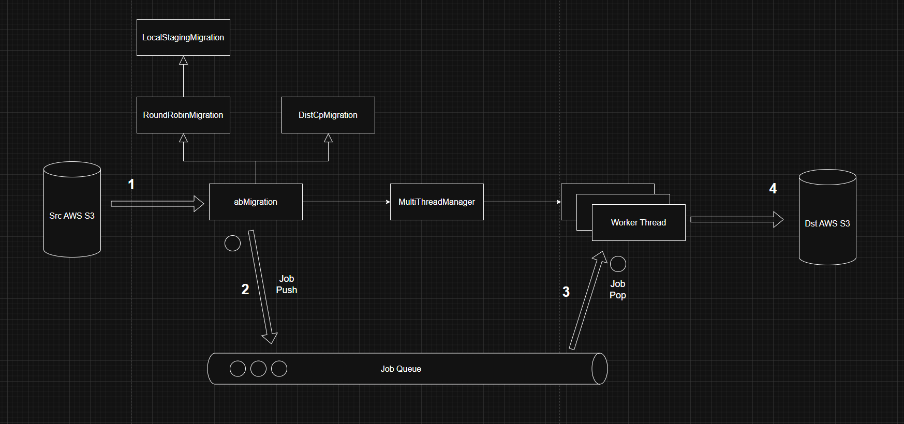

# data-migration

S3 버킷 간 데이터 마이그레이션 도구.  
멀티스레드 병렬 처리를 지원하며 두 가지 방식(DistCp / LocalStaging)으로 동작한다.

## 아키텍처



### 마이그레이션 방식

| 방식 | 설명 | 적합한 상황 |
|------|------|-------------|
| **DistCp** | S3 → S3 서버 사이드 복사 | 같은 리전 또는 네트워크 비용 절감 |
| **LocalStaging** | S3 → 로컬 임시 저장 → S3 | 다른 계정/리전 간 마이그레이션 |

### 처리 흐름

```
[Src S3 Bucket]
      │
      │  1. 파일 목록 조회
      ▼
[abMigration]
      │
      │  2. meta.json 파싱 (instrument_type, production_datetime 추출)
      │  3. 대상 경로 생성: {dst_root}/{instrument_type}/{timestamp}/{filename}
      ▼
[JobQueue] ──── [WorkThread × N]
      │
      ├── DistCpMigrationJob: src_storage.copy(src, dst)
      └── LocalStagingMigrationJob: download → local → upload → delete
```

## 디렉토리 구조

```
data-migration/
├── conf/
│   ├── application.conf          # 실행 설정 (S3 경로, 스레드 수 등)
│   ├── application_windows.conf  # Windows 실행 설정
│   ├── logging.conf              # 로그 설정 (Linux)
│   └── logging_windows.conf      # 로그 설정 (Windows)
├── deploy/
│   ├── Dockerfile                # Python 3.11 + uv 기반 이미지
│   └── docker-compose.yml        # 컨테이너 실행 설정
├── libs/
│   └── python_library-2.2.7-py3-none-any.whl  # 내부 공유 라이브러리
├── src/
│   ├── main.py                   # 진입점
│   ├── config/
│   │   └── project_config.py     # conf 파싱 및 설정 객체
│   ├── app/
│   │   ├── migration.py          # 추상 기반 클래스 (스레드/스토리지 초기화)
│   │   ├── dist_cp_migration.py  # S3→S3 직접 복사
│   │   ├── local_staging_migration.py  # 로컬 경유 복사
│   │   └── round_robin_migration.py    # 로컬 디스크 라운드로빈 선택
│   ├── job/
│   │   ├── dist_cp_migration_job.py        # 복사 작업 단위
│   │   └── local_staging_migration_job.py  # 다운로드/업로드 작업 단위
│   └── meta_data/
│       ├── meta_json.py   # 프로젝트 메타데이터 모델
│       ├── data_file.py   # 데이터 파일 정보 모델
│       └── extra.py       # 추가 메타데이터 모델
└── pyproject.toml
```

## 요구사항

- Python 3.11 이상
- [uv](https://docs.astral.sh/uv/) 패키지 매니저
- AWS 자격 증명 (환경 변수 또는 IAM 역할)

## 설치

```bash
git clone <repository-url>
cd data-migration
mkdir logs
uv sync
```

## AWS 자격 증명 설정

이 프로젝트는 AWS 자격 증명을 설정 파일에 직접 저장하지 않는다.  
boto3의 기본 자격 증명 체인을 따르므로 아래 중 하나를 사용한다.

### 1. 환경 변수

```bash
export AWS_ACCESS_KEY_ID=your_access_key_id
export AWS_SECRET_ACCESS_KEY=your_secret_access_key
export AWS_DEFAULT_REGION=ap-northeast-2
```

### 2. AWS CLI 프로파일

```bash
aws configure
```

### 3. IAM 역할 (EC2 / ECS / Docker)

EC2 인스턴스 프로파일 또는 ECS Task Role을 통해 자동으로 주입된다.

## 설정 파일

`conf/application.conf`를 수정하여 마이그레이션 대상 경로와 동작 방식을 설정한다.

```ini
[COMMON]
ProjectName = data-migration
ThreadCount = 20                          # 병렬 처리 스레드 수
LocalDownloadPath = /                     # LocalStaging용 임시 다운로드 루트 경로
LocalSeparator = /                        # 경로 구분자 (Linux: /, Windows: \)
VolumesPlaceHolder = data1 | data2 | data3  # LocalStaging용 로컬 디스크 목록 (라운드로빈)

[S3]
SrcRootPath = /bucket-name/path/to/source/  # 소스 S3 경로
DstRootPath = /bucket-name/path/to/dest/    # 대상 S3 경로
```

### meta.json

마이그레이션 대상 프로젝트 폴더에는 `meta.json` 파일이 존재해야 한다.  
이 파일에서 `instrument_type`, `production_datetime`을 읽어 대상 경로를 결정한다.

```json
{
  "schema_version": "1.0",
  "metadata_version": 1,
  "production_datetime": "2024-01-15T09:30:00Z",
  "instrument_type": "Astral",
  "instrument_name": "Astral-001",
  ...
}
```

대상 경로 형식: `{DstRootPath}{instrument_type}/{production_timestamp}/{filename}`  
예: `/oncx-dl-raw-dev/Astral/20240115T093000Z/sample.raw`

## 실행

### 로컬 실행

```bash
# DistCp 방식 (기본, S3→S3 직접 복사)
uv run -m src.main

# Windows 설정 파일 사용 시 main.py에서 주석 해제
# ProjectConfig.set_config("../conf/application_windows.conf")
```

### Docker 실행

```bash
# 이미지 빌드 및 실행
cd deploy
docker compose up -d

# 로그 확인
docker compose logs -f
```

> Docker Compose는 외부 브리지 네트워크 `infra-glue`를 사용한다.  
> 사전에 `docker network create infra-glue` 실행이 필요하다.

## 마이그레이션 방식 전환

`src/main.py`에서 주석을 변경하여 방식을 선택한다.

```python
# DistCp 방식 (기본)
dist_cp_migration = DistCpMigration()
dist_cp_migration.make_jobs()
dist_cp_migration.start()

# LocalStaging 방식 (아래 주석 해제)
# local_staging_migration = LocalStagingMigration()
# local_staging_migration.make_jobs()
# local_staging_migration.start()
```

## 로그

- 위치: `logs/data-migration.log`
- 로테이션: 매일 자정, 최근 7일 보관
- 포맷: `YYYY-MM-DD HH:MM:SS - data-migration - LEVEL - [TID:thread_id] - message`

## python-library 업데이트

`libs/` 디렉토리의 whl 파일은 `personal/python-library` 프로젝트에서 빌드한다.

```bash
# python-library 빌드
cd ../python-library
uv build

# whl 교체
cp dist/python_library-x.x.x-py3-none-any.whl ../data-migration/libs/

# pyproject.toml의 whl 파일명 버전 업데이트 후 lock 재생성
cd ../data-migration
uv lock
```
